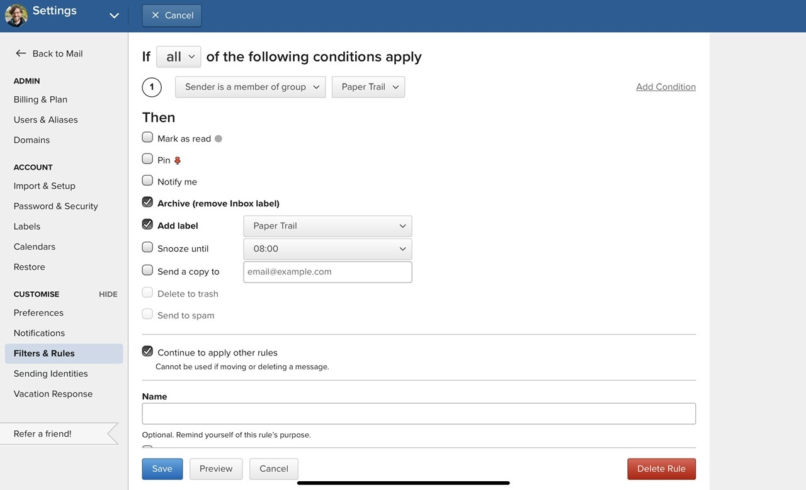

For various reasons I won’t get into here, I decided to switch from Hey email. I have really enjoyed their approach to email so I’d like to replicate some of it in [Fastmail](https://ref.fm/u26272200). 

I’d seen several helpful articles about setting up a Hey workflow with Fastmail, but they felt a bit combersome for me. I figured out a different approach to this, and wanted to share what I ended up with. 

## Why Fastmail?

Fastmail came recommended by several friends and has a long history of providing a solid service. Here’s what drew me to Fastmail:

* Privacy focused. It’s a paid service, which means they don’t need to sell your information to advertisers to make money and they provide tracking pixel blocking and image proxying.
* It’s about half the price of Hey.
* Supports multiple custom domains.
* Decent iOS apps.

Check out this [more detailed comparison with Hey](https://www.fastmail.com/hey-fastmail/).

## The Workflow

After a little experimentation and playing with the settings this is the workflow I’m now using with Fastmail.

1. Get a new email from an unknown sender. The email lands in the `Screener` label. 

2. I review the email and then either: 
    * Block the sender so any future emails go straight to the trash.
    * Add the sender to my contacts and then select which contact group it should belong to. “Feed” or “Paper Trail”. If I want to receive notifications I can make the contact a “VIP” contact.

3. Future emails land in the appropriate label.

## The Setup

The key to my workflow is using contacts and contact groups to filter incoming mail into various labels.

Fastmail can organise emails using folders (one email, one folder) or labels (one email, many labels). For my purposes I’m using labels. This is configured in `Settings -> Preferences` under the `Labels` section.

### Screening Emails

The first step is to setup a rule that applies to any unknown senders and apply a new label called `Screener`.

1. Go to `Settings -> Filters & Rules` and tap `+ Create Rule`. 
2. Select `Sender is not a contact` for the condition.
3. Tap `Continue`.
4. Tap `Create Rule` next to the search box.
5. In the create rule drop down check the `Archive (remove Inbox label)` and `Add Label`. Create a new label called `Screener`.

### Feed & Paper Trail

I want to sort transactional emails and newsletters into their own labels, leaving any other emails to go to my inbox.

To do this I setup contact groups called `Feed` and `Paper Trail` and setup rules to apply labels based on contacts in these groups.

1. Go to `Contacts` and tap `+` in the sidebar to create a new group. Create two groups called `Feed` and `Paper Trail`. 
2. Go to `Settings -> Filters & Rules` and tap `+ Create Rule`.
3. Select `Sender is a member of group...` and select `Feed` for the condition.
4. Tap `Continue`.
5. Tap `Create Rule` next to the search box.
6. In the create rule drop down check the `Archive (remove Inbox label)` and `Add Label`. Create a new label called `Feed`.
7. Repeat steps 2-6 for `Paper Trail`.

### Notifications

I want to only receive emails from specific senders so I’m not constantly receiving notifications for unimportant messages.

To do this we can configure Fastmail apps to only send notifications for “VIP” contacts. Then for the senders we want notifications for set them as VIP contacts.

## Conclusion

Once this is setup I can screen emails in my `Screener` label and either block them or add them as a contact. Newsletters and marketing emails get added to the `Feed` contact group. Transnational emails such as receipts and service notifications get added to the `Paper Trail` contact group. This leaves any important emails from senders I care about going to the Inbox.
